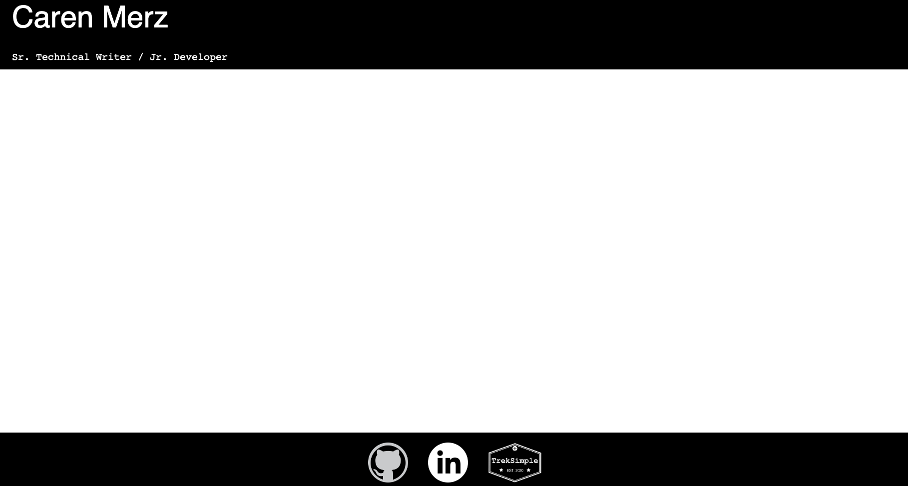

# My React Portfolio

## Table of Contents

- [Description](#description)
- [Usage](#usage)
- [Launch](#launch)
- [Technology](#technology)
- [Contributions](#contributions)
- [Questions](#questions)
- [License](#license)

## Description

This single page application (SPA) was built with React, and is an upgrade from my current live HTML/CSS portfolio. However, this site is still under construction. Check back soon!

## Usage :computer:

When you arrive at the [portfolio page](https://cammeer.github.io/cm-react-portfolio/), you can:

- View my About Me content and visit my GitHub profile, LinkedIn profile, and personal travel writing site
- View the portfolio of my projects, and click through to each deployment
- Use the contact form to send me a message
- View a summary of my experience as well as download my resume

## Launch :rocket:

[Click to visit the deployed portfolio site on GitHub Pages](https://cammeer.github.io/cm-react-portfolio/)

## Technology

This application was built with the help of the following languages, technology, and applications:

- [React](https://reactjs.org/)
- HTML
- CSS
- [Bootstrap](https://getbootstrap.com/)

## Contributions

I am the sole contributor to this personal portfolio.

## Questions?

Contact me with any questions at: [caren@merzhaus.org](caren@merzhaus.org)

## License

Copyright © 2022 [Caren Merz](https://github.com/cammeer).  
This project is [MIT](https://github.com/olivelliott/next-progress-bar/blob/main/LICENSE) licensed.
